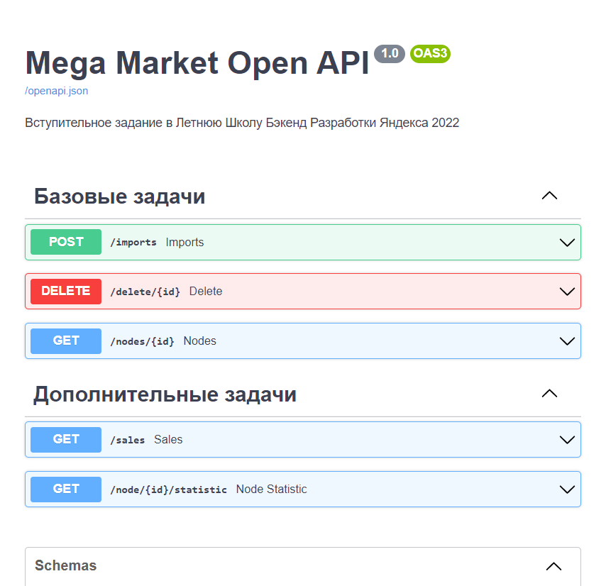
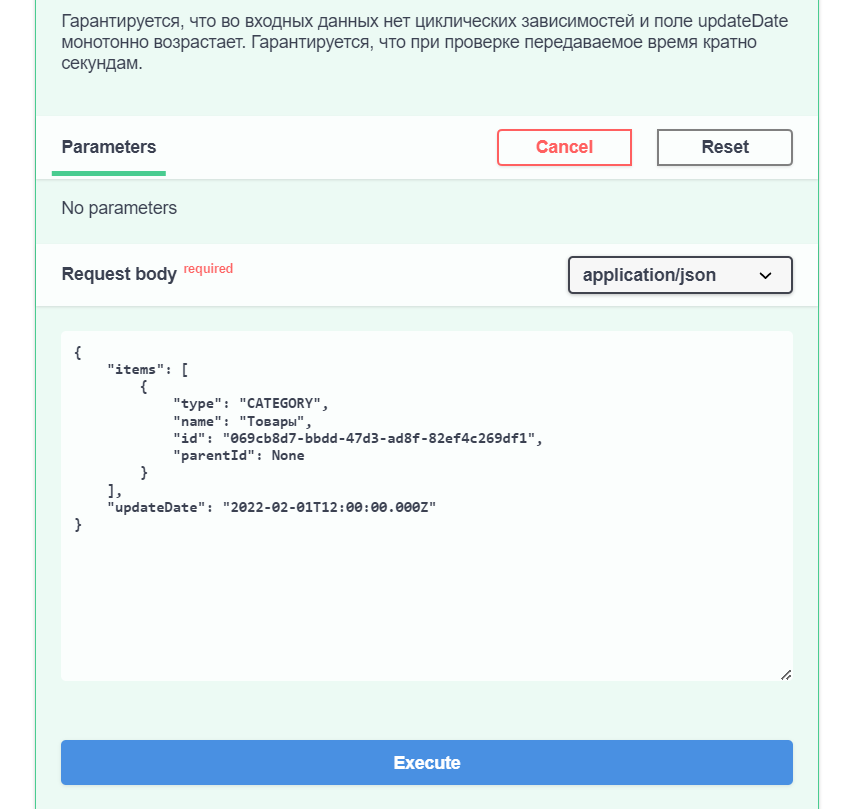
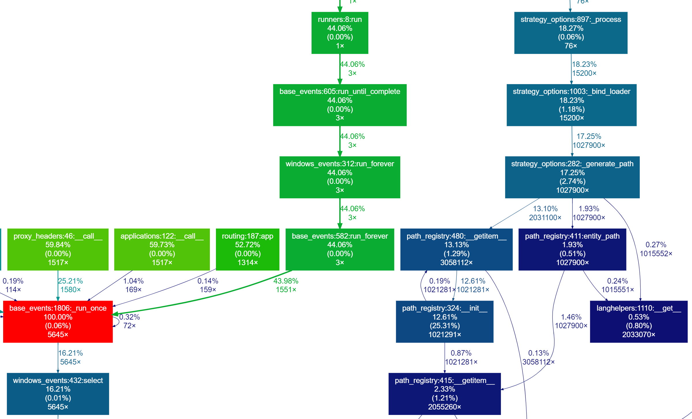
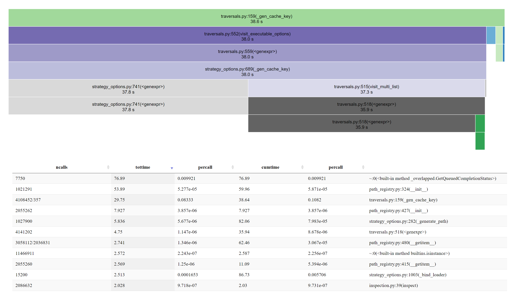

# `SBDY_app` (School of Backend Development of Yandex)

This is introductory task in the summer School of Backend Development of Yandex 2022.

```txt
                       __   __                    __                                                      
                      /\ \ /\ \                  /\ \                                                     
                      \ `\`\/'/   __      ___    \_\ \     __   __  _                                     
                       `\ `\ /' /'__`\  /' _ `\  /'_` \  /'__`\/\ \/'\                                    
                         `\ \ \/\ \L\.\_/\ \/\ \/\ \L\ \/\  __/\/>  </                                    
                           \ \_\ \__/.\_\ \_\ \_\ \___,_\ \____\/\_/\_\                                   
                            \/_/\/__/\/_/\/_/\/_/\/__,_ /\/____/\//\/_/                                   
                       ______                      __                                                     
                      /\  _  \                    /\ \                                                    
                      \ \ \L\ \    ___     __     \_\ \     __    ___ ___   __  __                        
                       \ \  __ \  /'___\ /'__`\   /'_` \  /'__`\/' __` __`\/\ \/\ \                       
                        \ \ \/\ \/\ \__//\ \L\.\_/\ \L\ \/\  __//\ \/\ \/\ \ \ \_\ \                      
                         \ \_\ \_\ \____\ \__/.\_\ \___,_\ \____\ \_\ \_\ \_\/`____ \                     
                          \/_/\/_/\/____/\/__/\/_/\/__,_ /\/____/\/_/\/_/\/_/`/___/> \                    
                                                                                /\___/                    
                                                                                \/__/                     
```

This is the second task in the process of selection to the School of Backend Development.
And this is my take on it.

The description of the task is in the [Task.md](Task.md).

## Installation

Open console in the root folder and run

```console
$ pip install .
```

## Launch

After installation just run in the console

```console
$ python -m SBDY_app
```

or run the python code

```python
from SBDY_app import run
run()
```

## Help

Run

```console
$ python -m SBDY_app -h
```

to see what arguments `run`/CLI takes

## Application's inner workings

If you visit the folder [`SBDY_app`](SBDY_app) or specifically [`SBDY_app/README.md`](SBDY_app/README.md), you can see an overview of how the app works.

## Known issues

From the fact that the async feature of sqlchemy is relatively new, and not so battle tested, there is a problem associated with quriyng a recursive structure.
Two options were presented to me: quick, but not completely working quriyng and completely working, but slow quriyng, here I chose the first options (Unfortunately, I did not have time to add these test cases).
And I also could not make it to work perfectly because of my exams, so I ask you to forgive me, please 🙏
In addition, I would be very grateful if you would check out the branch `working_but_slow` (I hope I used the correct commit) and, perhaps, run it through your tests too. Also look into [crud.py](SBDY_app/crud.py).

## REST API documentation

Run the app and then go to `http://<host>/docs` or `http://<host>/redoc`  
to see and play with an interactive documentation page (both are diffetren)



Click on the button "Try it out", it allows you to fill the parameters and directly interact with the API



## Testing

Visit the folder [`tests`](tests) or specifically [`tests/README.md`](tests/README.md) for documentation

## The choice of tools

### Web framework

I chose the [FastAPI](https://fastapi.tiangolo.com/) Python Web framework for handling the REST API requests.  
Among<!-- us ඞඞඞඞඞඞඞඞඞඞඞඞඞඞඞඞඞඞඞඞ why are you reading this? render the page, it's more beautiful -->
many other nice things it's performant and asynchronous.

### ASGI server

In the role of ASGI server, I chose [uvicorn](https://www.uvicorn.org/) as it seems like the lib used inside of FastAPI.  
Also see [`Choosing the Right ASGI Server for Deploying FastAPI`](https://github.com/tiangolo/fastapi/issues/2062).

### Testing framework

[Pytest](https://docs.pytest.org/en/latest/) is my favorite testing framework for Python, it's simple and pythonic.  
In addition to this, FastAPI recommends using it, so don't mind me if I do ;)

### Parsing YAML

To import and use the given [`openapi.yaml`](SBDY_app/openapi.yaml) for additional site documentation
I used [`PyYAML`](https://pyyaml.org/).  
It seems to be the most popular library for yaml parsing in python, and I don't need anything special, so great choice!

### Parsing ISO 8601 datetime

Also I needed to restrictively parse the ISO 8601 formatted strings.  
I could not use [`pydantic`](https://pydantic-docs.helpmanual.io/)s `datetime` validator because it allows too much.  
I settled down on [`ciso8601`](https://github.com/closeio/ciso8601), it's fast and strict.

## Profiling

> Also see the folder [`tests`](tests) or specifically [`tests/README.md`](tests/README.md) for documentation on how to run app appropriately for profiling

Open a terminal in the root of the repository and run the commands

```console
$ python -m cProfile -o profile.pstats SBDY_app/__main__.py
```

to generate a profiling output and run ([`gprof2dot`](https://github.com/jrfonseca/gprof2dot) requeued)

```console
$ python -m gprof2dot -f pstats profile.pstats > profile.gv
```

to generate a dot file that visualizes the profiling output



or ([`snakeviz`](https://jiffyclub.github.io/snakeviz/) requeued)

```console
$ python -m snakeviz profile.pstats
```

to dynamically look through the table of the profiling results


